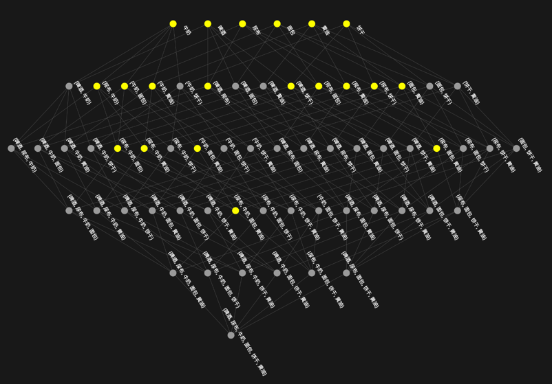

# Freq
Find frequent item set

这是一个编程练习, 题目来自赵卫东《商务智能》第5章数据挖掘思考题18: 画出项集格并标出频繁项集。
结果截图如下:

# Live Url:
http://freq.pa-ca.me/

# Test reference
http://andyshora.com/unit-testing-best-practices-angularjs.html

# CI Status
- http://jijiyy.pa-pa.me:8080/job/freq